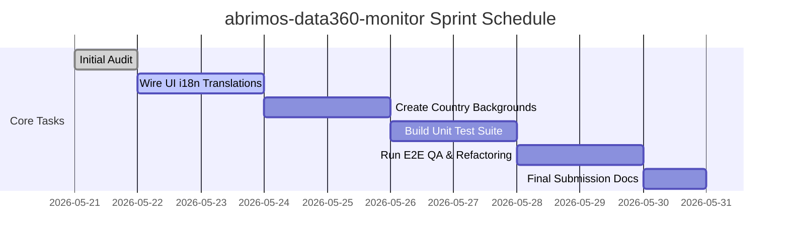

# Data360 Monitor: Project Review & Initial Audit

> **Review Date**: May 21, 2026
> **Project Scope**: abrimos-data360-monitor (Data360 Global Challenge, Phase 2)
> **Deadline**: May 31, 2026 (LAC Region Demo Focus)

> **Note (2026-05-22)**: This document captures a point-in-time audit. The
> figures in Section 4 (45 candidates, 35-indicator static run) describe
> that earlier pipeline state. Since then the project has added the
> Noticia/Reportaje two-phase output and an optional dynamic
> indicator-discovery mode (see `docs/architecture-overview.md`,
> `docs/features-reference.md`). Treat the numbers below as historical.

---

## 1. Executive Summary

The `abrimos-data360-monitor` is an autonomous monitoring dashboard designed to detect newsworthy economic, health, education, and institutional anomalies across LAC countries (Guatemala, Honduras, Argentina, Ecuador, and Mexico) using the World Bank's **Data360 API v3**. The system validates observations and embeds **Proof-Carrying Numbers (PCN)** claims directly into bilingual narratives.

Currently, the project is in a highly functional prototype state. The foundational server, routing, CSS styling, interactive sidebar drawer, and offline pipeline orchestrator are **fully implemented and verified**. The visual presentation is exceptionally premium, clean, and modern. 

However, as we approach the May 31 submission deadline, several critical gaps (localization, testing harness, and missing context assets) must be addressed to ensure a bulletproof deliverable.

---

## 2. Architecture: Production vs. Demo

The project establishes a clear division between a **scalable production roadmap** and a **cheap, deterministic demo runtime** for the challenge submission.

```mermaid
graph TD
    subgraph Demo Mode [Demo Mode - Offline & Deterministic]
        A[Local CSV Snapshots] --> B[generate-analysis.js]
        B -->|Z-score & Regional MAD| C[Detections]
        C -->|Claude Opus 4.7| D[Bilingual Narratives & PCN Claims]
        D -->|Write JSON| E[data/alerts.json]
        E -->|SSR Pug + Hydrated JS| F[Web Dashboard :8090]
    end
    
    subgraph Production Mode [Production Roadmap]
        G[Apache NiFi Scheduler] -->|Triggers| H[TeseoETL Fetcher]
        H -->|Direct REST API v3| I[JSONlines Export]
        I -->|NiFi Ingestion & Normalization| J[OpenSearch Store]
        J -->|Queries| K[Detection & LLM Layer]
        K -->|Verification Claims| L[React Web App]
    end
```



### Key Differences
* **Ingestion**: In production, Apache NiFi triggers the TeseoETL script to query Data360 REST endpoints and stream JSONlines. In the demo, historical snapshots are cached in country-specific CSVs.
* **Storage**: In production, normalized data resides in OpenSearch. In the demo, the pipeline loads CSV series directly from `data/context/{COUNTRY}/{tier}.csv` using `decimal.js` for safe arbitrary-precision math.
* **Narrative Synthesis**: One LLM call per indicator is made using the Claude CLI shim (`claude -p --model=opus`) or an OpenAI-compatible vLLM fallback endpoint, outputting standard-compliant JSON with PCN tokens.

---

## 3. Codebase Structural Map

The workspace is organized into highly modular, decoupled components:

* **Entrypoint**: `data360-monitor.js` spins up a vanilla Node.js HTTP server (listening on port `8090`), serves templates via Pug, handles static asset minification, and implements a dev file watcher using `chokidar`.
* **CLI Tools (`bin/`)**:
  * Legacy tier scripts (`fetch-baseline.js`, `fetch-pulse.js`, `fetch-forecast.js`) were removed from `bin/`; use `npm run fetch` (`bin/fetch-data.js`) only.
  * `generate-analysis.js`: Decoupled pipeline orchestrator that loads data, executes anomaly detection strategies, compiles integrated prompt contexts, calls the LLM, runs schema validation, and saves alerts.
* **Library Abstractions (`lib/`)**:
  * `router.js` & `views.js`: Simple, Express-free HTTP router and SSR page compiler.
  * `i18n.js`: Localization engine driven by JSON maps.
  * `ai-client.js`: Multi-provider LLM client with cost estimation, subprocess spawning for Claude, and vLLM fallbacks.
  * `detect/`: Contains Strategy 1 (`z-score.js` for abrupt deviations) and Strategy 4 (`cross-indicator.js` for regional MAD outlier analysis).
  * `analysis/`: Context compilers (`context-builder.js`), LLM wrappers, and JSON quality validators (`quality-validator.js`).
  * `pcn-claims.js`: Cryptographic claim SHA-256 generator.
* **Configuration (`config/`)**:
  * `routes.json`: Path-to-view compilation map.
  * `strings.{es|en}.json`: Bilingual localization translation sets.
* **Frontend Resources (`templates/` and `static/`)**:
  * Pug layouts, feeds, and mixins for responsive SSR rendering.
  * `static/js/behavior.js`: Pure Vanilla JS orchestrator (handles UI filtering, card presentations, and sidebar template bindings).

---

## 4. Pipeline Execution & Anomaly Detection

To verify the core analysis engine, we executed the generator in offline mode (using deterministic stubs for narratives):
```bash
node bin/generate-analysis.js --no-llm
```

### Quantitative Results
The system successfully evaluated **35 complex macroeconomic/social indicators** across the **5 target LAC countries**, yielding:
* **Total Candidates Detected**: 45
  * **Strategy 1 (Abrupt Changes)**: 22 candidates (deviation from 5-point moving baseline)
  * **Strategy 4 (Cross-Country Anomalies)**: 23 candidates (deviation from regional MAD median)
* **Output Generation**: Correctly compiled individual alert schemas, validated them against `docs/alert-schema.json`, and concatenated them into `data/alerts.json` (377KB payload).

This confirms the statistical detection layers (`z-score` and `MAD-scale`) are mathematical, functional, and reliable.

---

## 5. Visual & Functional Dashboard Audit

A live interactive inspection of the dashboard running on port `8090` was conducted. The front-end experience is premium, aesthetic, and responsive:

* **Grid Feed & Custom Cards**: Standard narrative-forward cards (`narr`), numeric-highlight cards (`num`), and newspaper headline formats (`news`) layout cleanly without overlaps.
* **Instant Filtering**: Selecting filters updates card visibility instantly using **Hybrid Show/Hide CSS toggles** (`.d360-card--hidden`) instead of triggering expensive server roundtrips, maintaining `0ms` latency.
* **Detail Panel (Drawer)**: Clicking a card triggers the HTML5 `<template>` injection, sliding out a rich analytics drawer from the right side of the screen.
* **Historical Trend Rendering**: Draws clean, inline vector SVGs outlining chronological paths, change markers, and historical ranges directly into the drawer.
* **Source Traceability & Verification**: Contains links to the direct Data360 dataset page, raw download links, and methodology guides.
* **Quote Copy Utility**: The `Copy quote` feature successfully retrieves the exact bilingual journalist narrative and places it into the clipboard with its corresponding World Bank source reference:
  ```text
  Auto-detected: ARG 11322.289801 IX in Consumer Prices, General Indices (2015 = 100) (2025-09-01). z-score +2.1σ against 5-point baseline.

  Source: https://data360.worldbank.org/en/int/dataset/FAO_CP
  ```

---

## 6. Critical Gaps Identified

Before submitting the prototype to the Media Party Hub, the following issues must be resolved:

### ⚠️ G-01: Incomplete UI Translation (Static Strings)
* **Status**: High Risk
* **Description**: Although the "ES / EN" lang toggles successfully update active classes and URL parameters, **90% of the UI shell remains hardcoded in English** in `templates/dashboard.pug` (e.g., "Country", "Category", "Card", "Last update", "events this week", and the "Subscribe" buttons).
* **Fix**: Replace these static texts with localizer variables, like `_('filters.country', lang)` and expand `config/strings.es.json` with the translation entries.

### ⚠️ G-02: Missing Automated Test Harness
* **Status**: Medium Risk
* **Description**: `package.json` maps `"test": "node test/run-tests.js"`, but the `test/` directory contains only a `.gitkeep` placeholder. No actual automated tests exist.
* **Fix**: Develop a simple test runner in `test/run-tests.js` to execute unit tests on the statistical anomaly detectors (`z-score` & `MAD`) and template rendering to avoid regression during final refactoring.

### ⚠️ G-03: Missing Country Contexts (`background.md`)
* **Status**: Low Risk
* **Description**: The prompt compiler in `lib/analysis/context-builder.js` looks for country profiles at `data/context/{COUNTRY}/background.md`. These files do not exist, resulting in the default `"No disponible en el contexto proporcionado."` fallback.
* **Fix**: Author brief 2-paragraph summaries for Guatemala, Honduras, Argentina, Ecuador, and Mexico outlining their basic economic backdrop to enrich the LLM's narrative synthesis.

### ⚠️ G-04: cost-tracking CLI execution dependencies
* **Status**: Low Risk
* **Description**: `lib/ai-client.js` is highly reliant on spawning a local `claude` binary shell. While fallbacks to vLLM are outlined, this could fail if credentials or binary paths differ in deployment.
* **Fix**: Validate the robustness of the fallback mechanism when environment variables like `AI_PROVIDER=vllm` are forced.

---

## 7. Recommended Action Plan (Next Steps)



1. **Complete UI Localization (Immediate)**: Update `templates/dashboard.pug` and `config/strings.*.json` to dynamic strings to unlock full ES/EN bilingual compliance.
2. **Develop Test Suite**: Implement `test/run-tests.js` to cover Strategy 1/4 algorithms and translation structures.
3. **Assemble Background Files**: Add background profiles to `/data/context/{COUNTRY}/background.md` to feed rich national contexts into Claude Opus prompt generation.
4. **Final Refactor & Cleanups**: Complete step 12 from the frontend architecture: clean up UMD references and complete public documentation in `docs/`.
