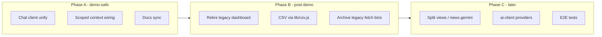

# Refactor evaluation

> **Status:** Planning document (May 2026). No implementation committed.  
> **Audience:** Maintainers preparing post-demo cleanup or scoped pre-demo consolidations.  
> **Related:** [product-phases.md](./product-phases.md), [frontend-architecture.md](./frontend-architecture.md), [architecture-overview.md](./architecture-overview.md), [data-fetcher-architecture.md](./data-fetcher-architecture.md).

This document records a codebase review of **potential** refactors for `abrimos-data360-monitor`. It does not prescribe immediate work. Product phases 1–5 are implemented; submission deadline is **2026-05-31**. Prefer bug fixes and demo stability over structural change until then unless a refactor directly unblocks a shipped feature.

---

## Executive summary

The repository is well suited to its demo architecture: Node.js CommonJS, static `data/alerts.json`, Pug SSR, vanilla client JS, no bundler. The analysis pipeline (`fetch` → `news` → `analyze`) and `lib/analysis/*` modules are cohesive and well tested.

Most maintainability debt comes from **product evolution** (country frontpage replacing the legacy monitor feed) and **feature growth** (full-page chat, floating FAB, scoped article chat, Gemini news ingest), not from a flawed core design.

**Recommendation:**

- **Before / during demo:** finish in-flight chat UI consolidation; fix data/routing bugs (claims, country assignment); sync outdated docs.
- **After demo:** retire legacy dashboard surfaces, unify CSV parsing, archive superseded fetch CLIs.
- **Later:** split very large modules (`news-gemini.js`, `views.js`, `ai-client.js`) when those areas stabilize.

Avoid ground-up rewrites (Express, React, ESM, client bundlers) unless requirements change explicitly.

---

## What to preserve

These choices align with standing decisions (see root `CLAUDE.md`) and should survive refactors:

| Constraint | Rationale |
|------------|-----------|
| CommonJS (`require` / `module.exports`) | Entire stack and tests assume it |
| `Decimal` for `OBS_VALUE` | Numeric integrity in detection |
| Brace-balanced JSON extraction | `lib/analysis/alert-extractor.js` — not regex-based |
| Static `data/alerts.json` output | Demo dashboard (D-008) |
| `CONTEXT_TIERS` without `pulse` | Analysis and PCN; pulse is legacy on disk only |
| No heavy client build step | Fast iteration, simple deploy |

---

## Pain points (ranked)

### 1. Dual / triple presentation layer — high impact, medium risk

Three user-facing “monitor” experiences coexist:

| Surface | Template / JS | Route |
|---------|---------------|-------|
| Country frontpage (product default) | `frontpage.pug` | `/{country-slug}` |
| Legacy monitor feed | `dashboard.pug`, `behavior.js` | `?legacy=1` on country URL, `/dev/feed` |
| Full-page chat | `chat.pug`, `static/js/chat.js` (~742 lines) | `/chat` |

`lib/views.js` (~550 lines) combines routing, i18n helpers, frontpage data assembly, JSON-LD, and legacy dashboard rendering.

`config/routes.json` is described in [frontend-architecture.md](./frontend-architecture.md) and [features-reference.md](./features-reference.md) but is **not loaded at runtime** — routing is hardcoded in `views.routePage()`.

**Proposed direction (post-demo):**

- Remove or gate legacy dashboard behind `D360_LEGACY=1` / dev-only.
- Delete `config/routes.json` or wire it for real (single source of route → handler).
- Split `views.js` into route dispatch (`lib/routes/`) and per-page builders (`lib/pages/`).

**Risk:** Broken bookmarks, tests asserting `/dev/feed` and `behavior.js`.

---

### 2. Chat client duplication — high impact, lower risk (in progress)

| File | Role | Approx. size |
|------|------|----------------|
| `static/js/chat.js` | Standalone `/chat` | ~740 lines |
| `static/js/floating-chat.js` | FAB; global or scoped | ~170 lines |
| `static/js/alert-chat.js` | Scoped article chat, session history | ~345 lines |
| `static/js/chat-turn-ui.js` | Shared turn / tool UI | ~400 lines |

Server side is more factored: `lib/chat/api.js`, `agent.js`, `tools.js`, `generation-context.js` (loads `data/analyses/{idno}.md` for scoped chat).

Branch `feat/v2-theme-alert-chat-context` consolidates scoped chat via `D360Chat.initScoped` and `chat-turn-ui.js` — the right pattern.

**Proposed direction:**

- Extract shared client module: SSE parsing, history, busy state, preset wiring, markdown render hooks.
- Keep `chat.js`, FAB, and inline panel as thin shells.
- Consolidate CSS (`wb-chat-embed.css`, `wb-chat-fab.css`, alert-chat styles) under one BEM block with modifiers.

**Defer** refactoring `lib/chat/tools.js` until the client surface is stable.

---

### 3. CSV parsing in three places — medium impact, low risk

| Module | Parser |
|--------|--------|
| `lib/csv.js` | `parseCsv` / `parseCsvLine` (tested in `test/csv.test.js`) |
| `lib/data-loader.js` | Inline `parseCsvRow` / `loadCsv` |
| `lib/pcn-verify.js` | Separate inline `parseCsv` |

**Proposed direction:** Route `data-loader` and `pcn-verify` through `lib/csv.js` to avoid quoted-field divergences.

---

### 4. Legacy fetch CLIs — low impact, very low risk

`bin/fetch-baseline.js`, `bin/fetch-pulse.js`, and `bin/fetch-forecast.js` are superseded by `bin/fetch-data.js` (see [data-fetcher-architecture.md](./data-fetcher-architecture.md)). `package.json` still exposes `fetch:baseline`.

**Proposed direction:** Move to `archive/bin/` or remove after confirming no external scripts depend on them.

---

### 5. `lib/news-gemini.js` (~1000+ lines) — medium impact, medium effort

Largest library file. Combines Gemini HTTP, retries, grounding URL resolution, batching, coverage logging, and JSONL writes.

**Proposed direction:** Split into focused modules (e.g. client, batch runner, grounding resolver) without changing `bin/fetch-news.js` CLI flags.

**Defer** while `GEMINI_*` env behavior is still changing.

---

### 6. `lib/ai-client.js` (~580 lines) — medium impact, defer

Providers: Claude CLI (`claude-code`), vLLM/LAIA, NVIDIA NIM. Separate resolution for analysis vs chat (`CHAT_AI_PROVIDER`).

**Proposed direction:** Strategy object per provider with shared cost logging.

**Worth it when** adding another provider or unifying streaming for analysis (today analysis uses non-streaming calls).

---

### 7. Documentation drift — low code risk, high confusion

[frontend-architecture.md](./frontend-architecture.md) still centers `dashboard.pug` as the primary view. Product reality (see [product-phases.md](./product-phases.md)):

- `/` → country picker + recent indicators  
- `/{país}` → `frontpage.pug`  
- `/indicador/{IDNO}` → indicator hub page  
- `/{país}/noticia|reportaje/...` → article pages  

**Proposed direction:** Docs-only update; remove or implement `routes.json`.

---

## Not refactors — correctness fixes (Fase 6)

Track these in [product-phases.md](./product-phases.md) as ops/content fixes, not structural rewrites:

| Issue | Likely modules |
|-------|----------------|
| Claims not rendering in article body | `lib/pcn-annotate.js`, `static/js/alert-page.js`, claim markers |
| Noticias / reportajes under wrong country | `lib/url-slug.js`, `_paths`, alert `country` / `countries` |
| MCP chat failures | `lib/mcp-client.js`, REST fallback in `lib/chat/tools.js` |
| Scoped chat missing generation context | `lib/chat/generation-context.js`, chat API `alert_id` |

---

## What to avoid

| Proposal | Why defer |
|----------|-----------|
| Express / Fastify | `http` + `lib/router.js` is sufficient for the demo |
| Vite / webpack | Conflicts with “no heavy client build” goal |
| ESM migration | Touches every file and test for little demo gain |
| React for dashboard | `design/v2` is reference-only per frontend spec |
| Single long-running “mega” process | Pipeline stays CLI-composed; NiFi path stays separate in production |

---

## Phased roadmap

### Phase A — Demo-safe (days)

1. Complete chat client consolidation (`alert-chat`, `floating-chat`, `chat-turn-ui`).
2. Ensure scoped chat consistently injects generation context (`generation-context.js`).
3. Update [frontend-architecture.md](./frontend-architecture.md); resolve `routes.json` (use or delete).

### Phase B — Post-demo cleanup (≈1–3 days)

1. Retire legacy dashboard (`dashboard.pug`, `behavior.js`, `/dev/feed`) or restrict to `D360_LEGACY=1`.
2. Centralize CSV parsing on `lib/csv.js`.
3. Archive legacy tier fetch scripts.

### Phase C — Maintainability (when pipeline churn slows)

1. Split `lib/views.js` and `lib/news-gemini.js`.
2. Optional `ai-client` provider modules.
3. Playwright E2E (deferred in `test/e2e-deferred.test.js`, see [test-plan.md](./test-plan.md)).

---

## Effort vs value

| Change | Value | Effort | Demo risk |
|--------|-------|--------|-----------|
| Chat client unify | High | Medium | Low (if tests pass) |
| Retire `dashboard.pug` | High | Medium | Medium (URLs / tests) |
| CSV single module | Medium | Low | Low |
| Archive legacy fetch bins | Low | Low | None |
| Split `news-gemini.js` | Medium | High | Medium |
| Split `ai-client.js` | Low–Medium | Medium | Medium (LLM paths) |
| Express / bundler / ESM | Low | Very high | High |

---

## Test gaps to address with refactors

| Gap | Notes |
|-----|--------|
| `test/views.test.js` | Covers lang/filters only — no HTTP tests for article paths or country picker |
| `routes.json` | Listed in test-plan but unused; add test only if config is wired |
| E2E | `test/e2e-deferred.test.js` — Playwright not configured |

When removing legacy UI, extend `test/server.test.js` for canonical routes: `/`, `/{slug}`, `/indicador/{IDNO}`, and a sample article path.

---

## File size reference (May 2026)

Largest modules worth watching:

| Path | Approx. lines | Notes |
|------|---------------|--------|
| `lib/news-gemini.js` | 1000+ | Split candidate |
| `static/js/chat.js` | 740 | Thin after client unify |
| `lib/chat/tools.js` | 560 | Cohesive; defer |
| `lib/views.js` | 550 | Split routing vs pages |
| `lib/ai-client.js` | 580 | Provider split later |
| `lib/analysis/runner.js` | 470 | Orchestrator; OK |

---

## References

- Standing decisions and pipeline commands: root `CLAUDE.md`
- Product delivery status: [product-phases.md](./product-phases.md)
- Demo vs production topology: [architecture-overview.md](./architecture-overview.md)
- Fetch tier consolidation: [data-fetcher-architecture.md](./data-fetcher-architecture.md)
- Chat behavior (user-facing): [user-guide.md](./user-guide.md)

---

*Last reviewed: 2026-05-26.*
